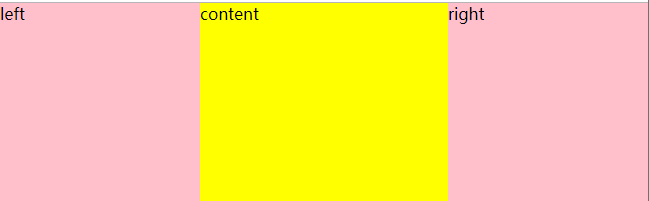
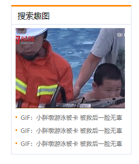
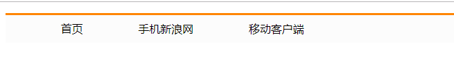
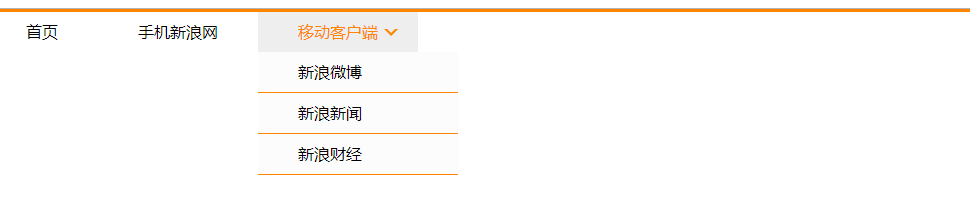

# css 实战应用

## 01 实现子盒子在父盒子中间垂直居中

```css
.parent {
	width: 500px;
	height: 500px;
	background-color: yellow;
	margin: 0 auto;
	position: relative;
}
.child {
	width: 150px;
	height: 150px;
	background-color: pink;
	position: absolute;
	top: 50%;
	left: 50%;
	margin-top: -75px;
	margin-left: -75px;
}

<ul>
  <li><a href="#">首页</a></li>
  <li><a href="#">手机新浪网</a></li>
  <li><a href="#">移动客户端</a></li>
</ul>
```

## 02 三列布局

> 要求：两边固定，中介自适应<br>
> 案例：<br> 

```
.left{
  width: 200px;
  height: 300px;
  background-color: pink;
  float: left;
}
.content{
  height: 300px;
  background-color: yellow;
  min-width: 600px;
}
.right{
  width: 200px;
  height: 300px;
  float: right;
  background-color: pink;
}
<div class="left">left</div>
<div class="right">right</div>
<div class="content">content</div>
```

## 03 搜索趣图案例

> 实现效果如下：<br>



```css
body,
ul,
li {
	padding: 0;
	margin: 0;
}
.news {
	width: 240px;
	height: 300px;
	margin: 300px auto;
	border: 1px solid #ccc;
	border-top: 3px solid #ff8500;
}
.news .title {
	height: 35px;
	line-height: 35px;
	padding-left: 15px;
	font-size: 20px;
	border-bottom: 1px solid #ccc;
}
.news .content img {
	display: block;
	margin: 8px auto;
}
.news .content ul {
	font-size: 12px;
	margin-left: 23px;
}
.news .content ul li {
	height: 26px;
	line-height: 26px;
}
li a {
	color: #333;
	text-decoration: none;
}
li:hover a {
	text-decoration: underline;
	color: #ff8500;
}

<div class="news">
    <div class="title"><span>搜索趣图</span></div>
    <div class="content">
      <div></div>
      <ul>
        <li><a href="#">GIF: 小胖墩游泳被卡 被救后一脸无辜</a></li>
        <li><a href="#">GIF: 小胖墩游泳被卡 被救后一脸无辜</a></li>
        <li><a href="#">GIF: 小胖墩游泳被卡 被救后一脸无辜</a></li>
      </ul>
    </div>
</div>
```

## 04 新浪导航栏案例 1

> 效果：<br> > 

```css
ul {
	border-top: 3px solid #ff8500;
	background-color: #fcfcfc;
	overflow: hidden;
}
ul > li {
	float: left;
	height: 40px;
	line-height: 40px;
	padding: 0 40px;
	list-style: none;
}
a {
	text-decoration: none;
	color: #000;
}
li:hover {
	background-color: #eee;
	cursor: pointer;
}
li:hover a {
	color: #ff8500;
}
<ul>
    <li><a href="#">首页</a></li>
    <li><a href="#">手机新浪网</a></li>
    <li><a href="#">移动客户端</a></li>
</ul>
```

## 05 新浪导航栏案例 2 (绝对定位的应用)

> 案例:
> 

```css
body,
ul,
li {
	padding: 0;
	margin: 0;
}
.menu {
	border-top: 3px solid #ff8500;
	background-color: #fcfcfc;
}
.menu > li {
	float: left;
	height: 40px;
	line-height: 40px;
	padding: 0 40px;
	list-style: none;
	position: relative;
	overflow: hidden;
}
a {
	text-decoration: none;
	color: #000;
}
.menu > li:hover {
	background-color: #eee;
	cursor: pointer;
	overflow: visible;
}
.menu > li:hover a {
	color: #ff8500;
}
.menu > li:hover .triangle::after {
	border-color: #eee transparent transparent;
}
.triangle {
	display: block;
	width: 0px;
	height: 0px;
	border: 7px solid #ff8500;
	border-color: #ff8500 transparent transparent;
	position: absolute;
	top: 17px;
	right: 20px;
}
.triangle::after {
	content: "";
	width: 0;
	height: 0;
	border: 10px solid red;
	border-color: #fcfcfc transparent transparent;
	position: absolute;
	top: 0;
	left: 0;
	transform: translate(-50%, calc(-50% - 3px));
}
.menu .menu-list {
	background-color: #fcfcfc;
	overflow: hidden;
	position: absolute;
	left: 0;
}
.menu .menu-list > li {
	width: 120px;
	height: 40px;
	line-height: 40px;
	list-style: none;
	padding: 0 40px;
	border-bottom: 1px solid #ff8500;
}
.menu .menu-list > li:hover {
	background-color: yellowgreen;
	color: bisque;
}

<ul class="menu">
  <li><a href="#">首页</a></li>
  <li><a href="#">手机新浪网</a></li>
  <li>
    <a href="#">移动客户端</a>
    <i class="triangle"></i>
    <ul class="menu-list">
      <li>新浪微博</li>
      <li>新浪新闻</li>
      <li>新浪财经</li>
    </ul>
  </li>
</ul>
```

# CSS3 介绍

## 一、边框阴影 (box-shadow)

> 应用：一般给图片添加阴影。<br>

语法格式：

```css
box-shadow: 水平阴影 垂直阴影 模糊距离 阴影尺寸 阴影颜色 内(inner) / 外阴影；;
```

### 案例：图片阴影

```css
img:hover {
	box-shadow: 2px 2px 8px #555;
}
```

## 二、边框(border)

> 边框圆角 <br>
> border-radius: 5px; <br>
> 案例:使用 Border 画梯形、圆形、三角形
> 梯形：

```css
.trap {
	width: 100px;
	height: 100px;
	/* background-color: pink; */
	margin: 0 auto;
	border: 50px solid black;
	border-color: black transparent transparent;
}
```

> 圆形：

```css
.circle {
	width: 00px;
	height: 00px;
	margin: 0 auto;
	border: 50px solid black;
	border-radius: 50%;
}
```

> 三角形：

```css
.triangle {
	width: 00px;
	height: 00px;
	margin: 30px auto;
	border: 50px solid black;
	border-color: black transparent transparent;
}

<div class="trap"></div>
<div class="circle"></div>
<div class="triangle"></div>
```

## 三、过渡（transition）

> 语法格式：<br>

```
transition: <property> <duration> <timing-function> <delay>

例如:
transtion: all 1s ease 0.5s;
```

> perperty: 要过渡的属性<br>
> duration: 花费的时间<br>
> timing-function：运动的模式<br>
> delay:延迟执行<br>

运动模式:


### 案例：

鼠标放上去有横/竖移动效果


代码：

```
.box{
      height: 100px;
      width: 100px;
      background-color: #aaa;
      transition: all 0.6s ease;
}
.box:hover{
  transform: translateX(100px)
}
```

## 三、Transform(转换、变换)

> 描述：进行移动。

> 特点：不影响原来的布局

1. translate(x,y)
   说明：移动方向，沿着 x 轴和 y 轴。<br>
   使用：transform: translate(x,y)

### 案例：子盒子在父盒子垂直居中

```
.parent{
      width: 800px;
      height: 600px;
      background-color: #ccc;
      position: relative;
}
.child{
      width: 150px;
      height: 150px;
      position: absolute;
      top: 50%;
      left: 50%;
      transform: translate(-50%,-50%); //移动自身的50%
      background-color: green;
    }
```

### 案例：小米官网鼠标悬停阴影

```css
body {
	background-color: #f5f5f5;
}
.box {
	width: 300px;
	height: 300px;
	background-color: #eee;
	margin: 30px auto;
	transition: all 0.2s linear;
}
.box:hover {
	box-shadow: 0 15px 30px rgba(0, 0, 0, 0.1);
	transform: translate3d(0, -2px, 0);
}
```

### 案例：小米官网鼠标悬停显示介绍

```css
 body{
      background-color: #f5f5f5;
    }
    .box{
      width: 238px;
      height: 300px;
      margin: 20px auto;
      background-color: #fff;
      position: relative;
      text-align: center;
      overflow: hidden;
      transition: all 1s;
    }
    span{
      font-size: 12px;
    }
    .promotion{
      height: 20px;
      line-height: 20px;
      background-color: #E53935;
      color: #fff;
      padding: 0 5px;
      text-align: center;
    }
    img{
      width: 150px;
      height: 150px;
    }
    .product~span{
      font-size: 14px;
      display: block;
      margin: 5px 0;
    }
    .description{
      color: #ccc;
      font-size: 10px!important;
    }
    .command{
      position: absolute;
      left: 0;
      bottom: 0;
      height: 0; //重点
      overflow: hidden;
      visibility: hidden;
      text-align: center;
      line-height: 75px;
      transition: all 1s ease;
      width: 100%;
    }
    .box:hover{
      box-shadow: 0 15px 30px rgba(0, 0,0, 0.1);
      transform: translate3d(0,-2px,0);
    }
    .box:hover .command{
      height: 75px;
      background-color: #ff6700;
      visibility: visible;
    }
<div class="box">
	<span class="promotion">减100元</span>
	<div class="product"></div>
	<span class="title">小米电视4A 32英寸</span>
	<span class="description">64位四核处理器/ 1GB+4GB大内存</span>
	<span class="price">
		<span style="color: #E53935">699元</span>&nbsp;
		<span style="text-decoration: line-through">799元</span>
	</span>
	<div class="command">
		很满意很开心
	</div>
</div>
```

### 案例：li 标签悬停变色

```css
li {
	height: 30px;
	width: 100px;
	background-color: #dbf1fd;
	border: 1px solid #00a1d6;
	color: #00a1d6;
	line-height: 30px;
	text-align: center;
	list-style: none;
	transition: all 0.6s linear;
}
li:hover {
	color: #fff;
	background-color: #00a1d6;
	cursor: pointer;
}
```

2. rotate(deg)
   说明：旋转，单位是度数，默认是旋转中心点。<br>
   使用：transform:rotate(60deg);<br>

### 案例：扑克牌旋转案例

```css
img {
	transition: all 0.5s ease;
}
img:hover {
	transform: rotate(180deg);
	transform-origin: bottom right;
}
```

## 四、Trasnform 3D

> 左手法则(如下图)


> CSS3 中的 3D 坐标系与上述的 3D 坐标系是有一定区别的，相当于其绕着 X 轴旋转了 180 度，如下图


> x 往屏幕里旋转是正值<br>
> y 往屏幕里旋转是正值<br>
> z 顺时针正值

### 1. rotateX()

> 演示：

```css
.box1,
.box2 {
	perspective: 1000px;
}
.box1 > img,
.box2 > img {
	transition: all 3s ease;
}
.box1 > img:hover {
	transform: rotateX(180deg);
}
.box2 > img:hover {
	transform: rotateX(-180deg);
}
```

### 2. rotateY()

> 演示：

```css
.box1,
.box2 {
	perspective: 1000px;
}
.box1 > img,
.box2 > img {
	transition: all 3s ease;
}
.box1 > img:hover {
	transform: rotateY(180deg);
}
.box2 > img:hover {
	transform: rotateY(-180deg);
}
```

### 3. rotateZ()

```css
.box1,
.box2 {
	perspective: 1000px;
}
.box1 > img,
.box2 > img {
	transition: all 3s ease;
}
.box1 > img:hover {
	transform: rotateZ(180deg);
}
.box2 > img:hover {
	transform: rotateZ(-180deg);
}
```

### 4.透视(perspective)

透视可以将一个 2D 平面，在转换的过程当中，呈现 3D 效果。

- 透视原理： 近大远小 。
- 浏览器透视：把近大远小的所有图像，透视在屏幕上。
- perspective：视距，表示视点距离屏幕的长短。视点，用于模拟透视效果时人眼的位置

注：并非任何情况下需要透视效果，根据开发需要进行设置。遵循近大远小的规则。

<b>perspective 一般作为一个属性，设置给父元素，作用于所有 3D 转换的子元素</b>

### 5.backface-visibility

> 语法：backface-visibility:none; <br>
> 注意：旋转的时候，2 个图片都需要旋转 180deg

#### 翻转盒子案例：

```css
.parent {
	position: relative;
}
.img2 {
	position: absolute;
	left: 0;
	top: 0;
}
img {
	transition: all 1s ease;
}
.parent:hover img {
	transform: rotateY(180deg);
}
.img2 {
	backface-visibility: hidden;
}
<div class="parent">
      
      
</div>
```

## 五、弹性盒子布局

### 传统布局三等分

> 使用百分比布局

```css
<style>
    *{
      margin: 0;
      padding: 0;
    }
    section{
      height: 300px;
      width: 800px;
      margin: 0 auto;
      border: 1px solid red;
    }
    div{
      width: 33.333%;
      height: 100%;
      float: left;
    }
    div:nth-child(1){
      background-color: green;
    }
    div:nth-child(2){
      background-color: yellowgreen;
    }
    div:nth-child(3){
      background-color: pink;
    }
</style>
</head>
<body>
  <section>
    <div class="box1"></div>
    <div class="box2"></div>
    <div class="box3"></div>
  </section>
</body>
```

>面临的问题：<br>
1、如果添加margin需要重新设计宽度，盒子会被挤下来。<br>
2、对每个盒子都需要计算百分比。<br>

解决方案：使用弹性盒子布局（flex）

### flex弹性盒子布局
1、display: flex
> 语法：<br>
在父盒子设置：display: flex; <br>
在子盒子设置：flex:1;

2、flex-direction: column/row (默认水平方向) <br>

3、justify-content:控制水平对齐方式
>justify-content: flex-start //默认值，从容器头部开始 <br>
>justify-content: flex-end //从容器尾部开始 <br>
>justify-content: center //居中对齐 <br>
>justify-content: space-between //左右2边贴父盒子，盒子中间留空 <br>
>justify-content: space-around //相当于给每个盒子都加了左右外边距

4、align-items:控制纵向怕排列方式
>align-item: stretch //默认值，让子元素高度拉伸等于父盒子高度（不设高度的情况下）<br>
>align-item: center; //垂直居中 <br>
>align-item: flex-start //顶部对齐 <br>
>align-item: flex-end //底部对齐 <br>

5、flex-wrap：控制是否换行
>flex-wrap: nowrap //默认值，不换行，强行在1行显示 <br>
>flex-wrap: wrap //自动换行。 <br>

### 练习：
> 子盒子在父盒子内垂直居中对齐
~~~
~~~
## PS基本使用
> 要求掌握：<br>
> * 简单实用抠图
> * 熟练切图

### PS界面组成：

菜单栏、选项栏、工具栏、浮动面板（拖拽名称，可单独操作面板）、绘图窗口
​    窗口菜单，可显示隐藏所有面板

工作区：（新建）

调整浮动面板

### 基本操作：
#### 1、新建文档 单位（像素）
#### 2、关闭文档，存储，存储为
#### 3、格式 .psd, .jpg
#### 4、文件打开
#### 5、移动工具v
#### 7、自由变形 ctrl+t, 按下回车确认操作
#### 8、选择图层：按ctrl
#### 9、复制图层： 
####   9.1、按ATL+拖拽图像
####   9.2、Ctrl+j
#### 10、撤销操作：
####   10.1 ctrl+z
####   10.2 ctrl+alt+z
#### 11、矩形选择区工具 M
#### 12、套索工具，磁性套索、魔棒工具（选区反选CTRL+Shift+I）
#### 13、切图：切片工具

> 13.1、 利用切片工具手动划出<br>
> 13.2、图层菜单---新建基于图层的切片<br>
> 13.3、 利用标尺   基于参考线的切片 （选择切片工具）<br>
> 13.4、 导出切片

## css3 实战综合案例
