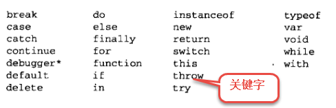
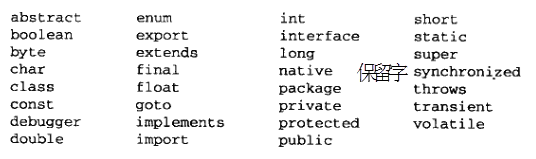
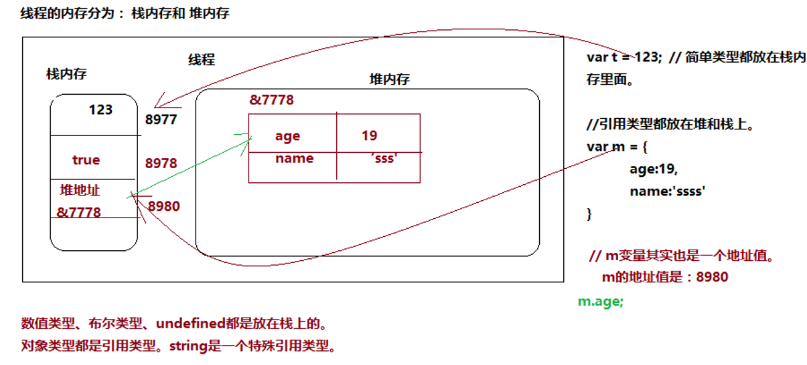
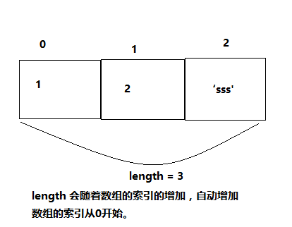

# 一、JavaScript 简介

> reference: https://developer.mozilla.org/en-US/docs/Web/JavaScript

## 1、JavaScript 是什么？

> JavaScript 是世界上用的最多的脚本语言。脚本语言：不需要编译，直接运行时边解析边执行的语言。
> 它可以运行在浏览器端、服务器端、移动端上进行各种编程操作。

### 1.1 JavaScript 特点：

> （1）借鉴 C 语言的基本语法；<br>
> （2）借鉴 Java 语言的数据类型和内存管理；<br>
> （3）借鉴 Scheme 语言，将函数提升到"第一等公民"（first class）的地位；<br>
> （4）借鉴 Self 语言，使用基于原型（prototype）的继承机制。<br>

### 1.2 javascript 组成

> ECMAScript：JavaScript 的语法。 <br>
> DOM：JavaScript 操作网页上的元素的 API <br>
> BOM：JavaScript 操作浏览器的部分功能的 API <br>

注：面试需求上的 ES6 就是指 JavaScript。

### 1.3 解释型语言

> JavaScript 是一门解释型语言，所谓解释型值不需要被编译（compile）为机器码在执行，而是直接编译为机器码在执行，而是直接执行。<br>
> JavaScript 和 java 的关系本质上有很大区别，只是看起来比较像而已。<br>
> 所谓的语言大同小异，在代码层次上相似，都是有变量，循环等等，语法有区别。

### 1.4 编写位置（演示）

#### JavaScript 的引入方式：

> 行内 JavaScript 脚本 <br>

```
<input type="button" onclick="alert(123)">
```

> Script 标签 <br>

```
<script>
  alert('123')
</script>
```

> 外部脚本 <br>

```
<script src="./js/01.js"></script>
```

# 二、JavaScript 语法

## 2.1、JavaScript 的标识符规范（变量，函数）

标识符就是名字，比如：变量，函数，属性，参数等名字。<br>

标识符规定：<br>

> 第一个字符必须是字母、下划线或者美元符号\$ <br>
> 其他的字符可以是字母、下划线、数字<br>
> JavaScript 是严格区分大小写，也就是 abc 和 Abc 会被认为是 2 个不同的东西。

```
例如：footerBar      bannerArea   _userName   $home2
错误例子：88Bar   &demo    address(Info)
```

## 2.2、JavaScript 的注释

> 行内注释：

```
// 注释内容
```

> 多行注释：

```
/*
注释内容
*/
```

> vs 快捷键： ctrl+/

## 2.3、变量（variable）

### 2.3.1、定义：

> 变量：源于数学的概念。变量，即是可以改变的量。也就是计算机内存中存储数据的标志符，变量的标识符指向的计算机存储空间可以存储相关的数据。<br>
>
> - JavaScript 中的变量是弱类型的，可以存储任何数据类型的数据。<br>
>   注：什么是弱类型语言？什么是强类型语言？

### 2.3.2、变量命名语法：

> 变量命名的语法： var a = 10; //var 是变量定义的关键字。语句的含义为：定义一个变量 a,并且给 a 赋值 10，也就是 a 指向的计算机存储空间中存储了 10 这个值。
>
> - 变量可以在声明的时候赋值，也可以稍后赋值。

```
例如：
var  a;  //定义变量a
a= "1222";//给a赋值字符串。
```

> 注：弱类型：变量的类型可以随时改变，不强迫类型一旦确定不能更改。

```
var a=10;
a="abc";
```

### 2.3.3、局部变量和全局变量

> 如果定义多个变量用“，”隔开 <br>
> 例如：var a, b = 9, c = 123;//都是局部变量 <br>
> 特殊情况：var a = b = c = 9;//var 只能作用到 a 上，b、c 都是全局变量。（面试题后期细讲） <br>

```
showNum();
alert(b);
function showNum(){
  var a=10;
  b=5, c=2;
  alert(a);
}
```

### 2.3.4、赋值语句

```
var a=123;
```

### 2.3.5、关键字和保留字（keyword and reserved word）

> 关键字：<br> >  <br>
> 保留字：<br> > 

# 三、JavaScript 数据类型

> JavaScript 数据类型为（简单数据类型 5 种）：<br>
>
> - 数值类型（Number）
> - 布尔类型（Boolean）
> - 字符串类型（string）
> - null 型
> - undefined 型 <br>

> 这 5 种之外都成为 Object 类型，所以 JavaScript 共有 6 种数据类型。

## 3.1、typeof 运算符

使用 typeof 操作符可以用来检查一个变量的数据类型。

> 使用方式：typeof 数据

```
typeof 123 //number
注：typeof null 显示为object
```

## 3.2、 Number 类型

>     Number类型，包括了所有的数字类型，包括：小数、整数、正负数、实数等。
>
> - Number 类型表示的数字大小是有范围的：1.7976931348623157e+308
> - NaN: not a number，非数字值 <br>
>   例如： parseInt("ss") //把字符串转换成数字，转换失败就会返回 NaN.

## 3.3、算数运算符

> - \+ : 加法。 10+10=20
> - \- : 减法。
> - \* : 乘法。
> - / : 除法。
> - % : 取余数。

```
// 算数运算符： +
var t = 10;
t = 10 + 290;
console.log(t); // => 300
// - 号
var m = 200;
console.log( t - m ); // t= 300, m = 200. ==> 100
// 乘法
console.log( t * m); // 300 *200 = ==>60000
// 除法
console.log( m / t); // 200 / 300 = 1.5
// 取余数
console.log( 7 % 4 );
```

## 3.4、Boolean 类型

> 布尔类型只有两个值：真 true 和 假 false。注意区分大小写，都是小写。

```
var  x =  true;//真
var y =  false;//假

var z  =  10 > 9;  // z=>true
```

### 3.4.1、 ==和===区别

```
var t = (1 === '1');  // t => false 三个等号比较值和类型。
var t = (1 == '1');    // t => true
```

## 3.5、字符串类型（string）

> 字符串就是由字符组成的串。<br>
>
> - 字符串都是用""或者''包裹起来。

```
var a = "1233"
a  = '123';
```

### 3.5.1、字面量转义符

> 在字符串中显示某些特殊字符如：',",

```
var a="\"";
```

## 3.6 undefined 类型

> undefined 类型只有一个值，即：undefined.（没有被定义的）<br>
> undefined 值出现的情况：
>
> - 当声明了一个变量，而未赋值的时候，则变量的值为 undefined.
> - 当调用一个函数，没有返回值的时候，返回 undefined.

```
var a;
console.log(a);
```

## 3.7 null 类型

> null 只是对象类型的一个值 null：空对象。

```
var  a = null;//定义一个空对象。
null ==  undefined //true，都表示空
null === undefined // false ，类型不同
```

# 四、JavaScript 运算符（Operators）

> 运算符分类：
>
> - 算数运算符（Arithmetic Operator）
> - 赋值运算符（Assignment Operator）
> - 关系运算符（Comparison Operator）
> - 逻辑运算符（Logical Operator）
> - 类型运算符（Type Operator）讲过了
> - 位操作符（Bitwise Operator）不讲

## 4.1、算数运算符（Arithmetic Operator）

| Operator |           Description            |
| :------: | :------------------------------: |
|    +     |         加法（addition）         |
|    -     |       减法（Subtraction）        |
|    \*    |      乘法（Multiplication）      |
|   \*\*   |      Exponentiation （ES6）      |
|    /     |        除法 （Division）         |
|    %     | 取余 Modulus(Division Remainder) |
|    ++    |        自增（Increment）         |
|    --    |        自减（Decrement）         |

### 4.1.1、自增自减运算（Increment，Decrement）

> 自增运算符，用两个连续的+号。比如： ++i t++. <br>
> 如果两个加号在变量前面，先进行自增运算再进行表达式运算。 <br>
> 不然，先进行表达式运算，后进行自增运算。 <br>

```js
var i = 9;
i++; // 自增运算符， 自己增加1
// i = i + 1;
console.log(i); // =>10
// 自加运算符在前面的时候，先进行自加运算，再参与表达式的运算。
```

> 练习题：

```js
var n1 = 10;
var n2 = 20;

var n = n1++; //n1 = 11  n1++ = 10

console.log("n=" + n); // 10
console.log("n1=" + n1); //11

n = ++n1; //n1 = 12  ++n1 =12
console.log("n=" + n); //12
console.log("n1=" + n1); //12

n = n2--; // n2=19 n2--=20
console.log("n=" + n); //20
console.log("n2=" + n2); //19

n = --n2; //n2=18 --n2 = 18
console.log("n=" + n); //18
console.log("n2=" + n2); //18
```

### 4.1.2、 +的应用

> 加法运算符分为字符串连接运算和算数加法运算。

> - 当对非 Number 类型的值进行运算时，会将这些值转换为 Number 然后在运算。
> - 任何值和 NaN 做运算都得 NaN。
> - 当有字符串的时候，任何值和字符串连接都是先转成字符串再做字符串拼接操作。
> - 任何的值和字符串做加法运算，都会先转换为字符串，然后再和字符串做拼串的操作

```js
var a = 123;

result = a + 1;

result = 456 + 789;

result = true + 1;

result = true + false;

result = 2 + null;

result = 2 + NaN;

result = "你好" + "大帅哥";

var str = "锄禾日当午，" + "汗滴禾下土，" + "谁知盘中餐，" + "粒粒皆辛苦";

result = 123 + "1";

result = true + "hello";

var c = 123;

c = c + "";

//c = null;

//c = c + "";

//console.log(result);
//console.log(typeof c);
//console.log("c = "+c);

result = 1 + 2 + "3"; //33

result = "1" + 2 + 3; //123

result = 100 - 5;

result = 100 - true;

result = 100 - "1";

result = 2 * 2;

result = 2 * "8";

result = 2 * undefined; //undefined

result = 2 * null; //0

result = 4 / 2;

result = 3 / 2;
```

## 4.2、 赋值运算符（Assinment Operator）

> 等号，就是最常用的赋值运算符。

- 注意：=不是等号，是赋值！a=9:把 9 放到 a 里面。

```
var a = 9;
var a = 9, b = 3, c =4;
```

### 4.2.1、赋值连写（推荐）

```
a  = a + 10;//当+-*/运算符跟自己进行运算时可用简写成
a += 10;// 跟 a = a + 10 效果一样。
a *= 2;   a -= 3;  a/= 3;   4%=2;
```

## 4.3、关系运算符（comparison Operator）

| Operator |        Description         |
| :------: | :------------------------: |
|    ==    |          equal to          |
|   ===    | equal value and equal type |
|    !=    |          equal to          |
|   !==    |          equal to          |
|    >     |          equal to          |
|    <     |          equal to          |
|    >=    |          equal to          |
|    <=    |          equal to          |
|    ?     |      ternary operator      |

### 4.3.1、相等==运算符

> - 相等运算符用来比较两个值是否相等，如果相等会返回 true，否则返回 false
> - 当使用==来比较两个值时，如果值的类型不同，则会自动进行类型转换，将其转换为相同的类型，然后在比较。

### 4.3.2、 不相等!= 运算符

> - 不相等用来判断两个值是否不相等，如果不相等返回 true，否则返回 false

### 4.3.3、全等=== 运算符

> - 用来判断两个值是否全等，它和相等类似，不同的是它不会做自动的类型转换
> - 如果两个值的类型不同，直接返回 false

```js
//console.log(1 == 1); //true

var a = 10;

//console.log(a == 4); //false

//console.log("1" == 1); //true

//console.log(true == "1"); //true

//console.log(null == 0); //false

/*
 * undefined 衍生自 null
 * 	所以这两个值做相等判断时，会返回true
 */
//console.log(undefined == null);
/*
 * NaN不和任何值相等，包括他本身
 */
//console.log(NaN == NaN); //false

//console.log(10 != 5); //true
//console.log(10 != 10); //false
//console.log("abcd" != "abcd"); //false
//console.log("1" != 1);//false

//console.log("123" === 123);//false
//console.log(null === undefined);//false
```

### 4.3.4、 \>, <, >=, <=

> - 通过关系运算符可以比较两个值之间的大小关系，成立会返回 true,不成立返回 false。
> - - 非数值的情况：
> - 对于非数值的进行比较时，会将其转换为数字然后再比较。
> - 如果 2 侧都是字符串，不会将其转换数字比较。会比较字符串的 Unicode 编码。

> - 用来判断两个值是否全等，它和相等类似，不同的是它不会做自动的类型转换
> - 如果两个值的类型不同，直接返回 false

```js
console.log(1 > true); //false
console.log(1 >= true); //true
console.log(1 > "0"); //true
console.log(10 > null); //true
//任何值和NaN做任何比较都是false
//hello转成数字是NaN
console.log(10 <= "hello"); //false
console.log(true > false); //true

console.log("1" < "5"); //true
console.log("11" < "5"); //true

//比较两个字符串时，比较的是字符串的字符编码
console.log("a" < "b"); //true
//比较字符编码时是一位一位进行比较
//如果两位一样，则比较下一位，所以借用它来对英文进行排序
console.log("abc" < "bcd"); //true
```

### 4.3.5、（重要）ternary operator (三元运算符)

> - 语法：条件表达式?语句 1:语句 2;

```js
var a = 300;
var b = 143;
var c = 50;

//a > b ? alert("a大"):alert("b大");
//获取a和b中的最大值
//var max = a > b ? a : b;
//获取a b c 中的大值
//max = max > c ? max : c;
```

## 4.4、逻辑运算符（Logical Operator）

### 4.4.1、 !非 （不）

> - 可以用来对一个值进行非运算。（取反）。true 变成 false.
> - 可以用这个类型的特点，将其他类型的值转换成布尔值。

### 4.4.2、&& 与 （and）

> 运算规则：
>
> - 2 个值只要有一个值为 false 就返回 false。只有 2 边同时为 true 的时候才返回 true。
> - 短路表达式：第一个值为 false 的时候，就不会看第 2 个值。
> - - 通常用于，if true?，也就是说，第一个值是 true，才会看第 2 个值。

### 4.4.3、||或（or）

> 运算规则：
>
> - 2 个值只要有一个 true，就返回 true。
> - 短路表达式：第一个值为 true 的时候，就不会看第 2 个值。
> - - 通常用于第一个值是 false 的时候，才会看第 2 个值。

```js
//如果两个值都是true则返回true
var result = true && true;

//只要有一个false，就返回false
result = true && false;
result = false && true;
result = false && false;

//console.log("result = "+result);

//第一个值为true，会检查第二个值
//true && alert("看我出不出来！！");

//第一个值为false，不会检查第二个值
//false && alert("看我出不出来！！");

//两个都是false，则返回false
result = false || false;

//只有有一个true，就返回true
result = true || false;
result = false || true;
result = true || true;

//console.log("result = "+result);

//第一个值为false，则会检查第二个值
//false || alert("123");

//第一个值为true，则不再检查第二个值
//true || alert("123");

var a = false;

//对a进行非运算
a = !a;

//console.log("a = "+a);

var b = 10;
b = !!b;

//console.log("b = "+b);
//console.log(typeof b);

//true || true
//如果第一个值为true，则直接返回第一个值
result = 2 || 1;
result = 2 || NaN;
result = 2 || 0;

//如果第一个值为false，则直接返回第二个值
result = NaN || 1;
result = NaN || 0;

result = "" || "hello";
//负值算true，只有0的时候才算false。
result = -1 || "你好";
```

> 综合练习

```js
var a = "1",
	b = 3,
	c = true;
console.log(a > b); //false
console.log(a >= c); //true;
console.log(!b); //false;
console.log(!!a); ///true;
console.log(a + b); //13;
```

# 五、类型转换

## 5.1、转数字类型

### 5.1.1、Number() 函数

> Number 函数转数值类型<br>
> 语法：NUmber(值)
>
> 1.  如果是布尔值，true 为 1，false 为 0;

```js
Number(false);
```

> 2.  如果是数字值，返回本身。
> 3.  如果是 null，返回 0.
> 4.  如果是 undefined, 返回 NaN。
> 5.  如果是字符串，遵循以下规则：
>
> - 只包含数字，将其转换为 10 进制数字。（忽略前面 0）。
> - 空字符串，转为 0.
> - 非以上格式，转为 NaN.
>
> 6.  加法操作和 Number 效果一致。

```js
var b,
	a = false;
b = +a; // b =  0  => b= Number(a);
b = +"123"; //  b = 123 ,把字符串转为数字
```

### 5.1.2、parseInt()函数

> 1. 忽略字符串前面的空格，直至找到第一个非空字符。
> 2. 如果第一个不是数字或者负号，返回 NaN。
> 3. 如果第一个是数字，一致解析至非数字符号。
> 4. 没有四舍五入。

### 5.1.3、parseFloat()函数

> 等同 parseInt()

## 5.2、Boolean()函数

> 把值转换成布尔类型
>
> - 以下值会被转为 false：
>
> 1. false
> 1. ""（空字符串）
> 1. 0
> 1. NaN
> 1. null
> 1. undefined
>
> - 其余值都会为 true.

## 5.3、字符串类型的转换

> 把任何类型转换字符串类型 String()或者.toString()方法。
>
> - null, undefined, NaN, false, true 都是为 "null"...
> - 也可以+""的方式转为字符串。

# 六、JavaScript 语句

## 6.1、流程控制语句 if 相关（重要）

> JS 中的程序是从上到下一行一行执行的，通过流程控制语句可以控制程序执行流程，使程序可以根据一定的条件来选择执行。

### 6.1.1、 If 语句

> 语法：if(表达式) {语句块}

```js
var a = 25;

if (a > 10 && a <= 20) {
	alert("a大于10，并且 a小于等于20");
}
```

### 6.1.2、 if...else...语句

> 语法:

```js
if(条件表达式){
  语句...
}else{
  语句...
}
// 代码演示：
var age = 50;

/*if(age >= 60){
  alert("你已经退休了~~");
}else{
  alert("你还没退休~~~");
}*/
```

### 6.1.3、if...else if...else if..else

```js
age = 90;

if (age > 17 && age <= 30) {
	alert("你已经成年了");
} else if (age > 30 && age <= 60) {
	alert("你已经中年了");
} else if (age > 60 && age <= 80) {
	alert("你已经退休了");
} else {
	alert("你岁数挺大的了~~");
}
```

## 6.2、循环语句 While（了解）

> 语法：
> while(条件表达语句){ <br>
> 语句<br>
> }<br>
> 说明：
>
> - 先对条件表达式进行求值判断，如果值为 true，则执行循环体
> - 循环体执行完毕以后，继续对表达式进行判断.
> - 如果为 true，则继续执行循环体，以此类推.
> - 如果为 false,则终止循环。

### 6.2.1 while 练习

> 练习题 1：<br>
> 需求：假如投资的年利率为 5%，试求从 1000 块增长到 5000 块，需要花费多少年。

```js
var year = 0,
	deposit = 1000;
while (deposit < 5000) {
	deposit *= 1.05;
	year++;
}
console.log(year);
```

> 练习题 2：<br>
> 需求：求 1-100 的和？

```js
var i = 1;
var sum = 0;
while (i <= 100) {
	sum += i;
	i++;
}
console.log(sum);
```

## 6.3、 do...while...（了解,基本不用）

> 语法：<br>
> do{ <br>
> 语句<br>
> }while(表达式);

```js
var i = 1;
do {
	document.write(i++ + "<br />");
} while (i <= 10);
```

## 6.4、for 循环（重要）

> 语法：
> for(初始化语句; 判断语句; 循环结束语句){ <br>
> 循环体执行的语句; <br>
> }
>
> - 特点都有 1 个变量，一般使用 i,j,k
> - 在循环体内，都需要对循环的索引+1
> - 都需要有一个出口。

### 6.4.1 案例 1

> 需求：求 1-100 的和

```js
var sum = 0;
for (i = 0; i <= 100; i++) {
	sum += i;
}
console.log(sum);
```

### 6.4.2 案列 2

> 需求:打印 1-100 之间所有奇数之和

```js
var sum = 0;
for (var i = 0; i <= 100; i++) {
	if (i % 2 > 0) {
		sum += i;
	}
}
console.log(sum);
```

### 6.4.3 案例 3

> 需求：打印 1-100 之间所有 7 的倍数的个数及总和。

```js
var count = 0,
	sum = 0;
for (var i = 0; i <= 100; i++) {
	if (i % 7 == 0) {
		count++;
		sum += i;
	}
}
console.log("总和是：" + sum + "。7的倍数共有" + count + "个");
```

### 6.4.4 案例 4 水仙花

> 需求：水仙花数是指一个 3 位数，它的每个位上的数字的 3 次幂之和等于它本身。
>
> - （例如：1^3 + 5^3 + 3^3 = 153）,请打印所有的水仙花数。

```js
for (var i = 100; i < 1000; i++) {
	// var hundredth=0;
	// var tenth=0;
	// hundredth=Number.parseInt(i/100);
	// tenth=Number.parseInt((i-hundredth*100)/10);
	// if (Math.pow(hundredth, 3) + Math.pow(tenth, 3) + Math.pow(i % 10, 3) == i) {
	//   console.log(i)
	// }
	Math.pow(parseInt((i / 100) % 10), 3) +
		Math.pow(parseInt(i / 10) % 10, 3) +
		Math.pow(parseInt(i % 10), 3) ==
		i && console.log(i);
}
```

### 6.4.5 案例 5 判断是否为质数

> 需求：判断一个数字是否为质数。
>
> - 质数：只能被 1 和他本身整除的数，1 不是质数，必须大于 1 的自然数。

```js
var num = 23;
var flag = true;
for (i = 2; i < num; i++) {
	if (num % i == 0) {
		console.log("这个不是质数。");
		flag = false;
		break;
	}
}
flag && console.log("这个数字是质数");
```

## 6.5、break 和 continue 区别

> break <br>
>
> - 在循环内部使用 break，代表结束当前循环并跳出当前循环。
>   continue<br>
> - 在循环内部使用 continue,代表结束本次循环，并继续下一次循环。

```js
for (var i = 0; i < 10; i++) {
	if (i % 7 == 0) {
		continue; //立即执行 结束执行语句，并执行下次循环
		//break
	}
}
```

## 6.6、for 循环嵌套练习

### 6.6.1、 通过程序输出以下图形（\*）<br>

> ☆☆☆☆☆ <br>
> ☆☆☆☆ <br>
> ☆☆☆ <br>
> ☆☆ <br>
> ☆ <br>

```js
var num = 5;
for (var i = 0; i < num; i++) {
	for (var j = 0; j < num - i; j++) {
		document.write("* ");
	}
	document.write("<br>");
}
```

### 6.6.2、打印 99 乘法表

> 1x1=1<br>
> 1x2=2 2x2=4<br>
> 1x3=2 2x3=6 3x4=12<br>
> 1x4=2 2x4=8 3x4=12 4x4=16<br>
> ...<br>

代码：

```js
for (var i = 1; i <= 9; i++) {
	for (var j = 1; j <= i; j++) {
		document.write(j + "x" + i + "=" + i * j + " ");
	}
	document.write("<br>");
}
```

### 6.6.2、打印 1-100 所有的质数（prime numbers）

```js
for (i = 2; i <= 100; i++) {
	var flag = true;
	for (j = 2; j < i; j++) {
		if (i % j == 0) {
			flag = false;
			break;
		}
	}
	flag && console.log(i);
}
```

## 6.7、switch-case 语句

> 语法：

```js
switch (n) {
	case 1:
		执行代码块;
		break;
	case 2:
		执行代码块;
		break;
	default:
		xxxx;
```

> 案例：<br>
> 把一个数字 1-7 之间，返回相应的星期，1：星期一。2：星期二。。。

```js
var num = 5;
switch (num) {
  case 1: // 当num === 1的时候，执行冒号后面的语句。
    console.log("星期一");
    break; // 跳出当前的switch语句
  case 2:
    console.log("星期二");
    break;
  case 3:
    console.log("星期三");
    break;
  case 4:
    console.log("星期四");
    break;
  case 5:
    console.log("星期五");
    break;
  case 6:
    console.log("星期六");
    break;
  // case 8:
  // case 9:
  // case 10:
  // console.log('error');
  // break;
  default:
    console.log("星期日");
}
}
```

# 七、函数基础

## 7.1、函数的定义（方法）

### 7.1.1、什么是函数？

> - 函数由数学中定义中引申来。
> - 函数中可以封装一些功能（代码）。
> - 函数中科院保存一些代码，在需要的时候调用。
> - 可以理解为是一个黑盒子（black box）。<br>

语法：

function 函数名（形参 1，形参 2....n）{ <br>
语句 <br>
}

> 注：函数名必须以字母、下划线、\$开头。后面可以跟数字。
>
> - 如果函数没有返回值，返回 undefined.

### 7.1.2、练习

```js
function fun2() {
	console.log("这是我的第二个函数~~~");
	alert("哈哈哈哈哈");
	document.write("~~~~(>_<)~~~~");
}
//实现2个数相加
function add(a, b) {
	return a + b;
}
// 函数调用：
var result = add(1, 2);
console.log(result);
```

## 7.2、匿名函数 （anonymous function）

> 定义：<br>
>
> - 匿名函数就是没有函数名的函数。一般会把匿名函数当成一个变量使用
> - 匿名函数声明完了后立即调用自己。

```js
var f = function(a) {
	return a * a;
};
console.log(f(3))(
	/*
	 * 立即执行函数
	 * 	函数定义完，立即被调用，这种函数叫做立即执行函数
	 * 	立即执行函数往往只会执行一次
	 */
	(function(){
				alert("我是一个匿名函数~~~");
	})();

	(function(a, b) {
      console.log("a = " + a);
      console.log("b = " + b);
	})(123, 456);
```

# 八、对象（object）

> 定义：
>
> - 对象属于一种复合的数据类型，在对象中可以保存多个不同数据类型的属性。
> - 也就是一个整体，任何东西都可以作为对象。

> 详细说明：<br>
> 在 JS 中可以表示一个人的信息（name gender age）

```js
var name = "孙悟空";
var gender = "男";
var age = 18;
//如果使用基本数据类型的数据，我们所创建的变量都是独立，不能成为一个整体。
```

> - 以后我们所有开发针对都是对象。就是所谓的 object-oriented programming

> 对象的分类：<br>
>
> - 1.  内建对象
>   - 由 ES 标准中定义的对象，在任何 ES 的实现中都可以使用
>   - 比如：Math String Number Boolean Function Object ...
> - 2.  宿主对象
>   - 由 JS 的运行环境提供的对象，目前来讲主要指由浏览器提供的对象
>   - 比如：BOM DOM document.write()
> - 3.  自定义对象
>   - 由开发人员自己创建的对象。

## 8.1、创建对象的 2 种方式

### 8.1.1 需要掌握的

> - 创建对象
> - 往对象里添加属性的 2 种方法。

### 8.1.2、第一种使用 new。

```js
var obj = new Object(); //一般不用这种方式。
//向obj中添加一个name属性
//第一种方式：使用.的方式
obj.name = "孙悟空";
obj.gender = "男";
obj.age = 18;
//第二种方式：使用[]
obj["ability"] = "72变";
//读取对象的属性
console.log(obj.name);
//修改属性
obj.name = "二郎神";
console.log(obj.name);
//向Obj中添加方法。
obj.run = function() {
	console.log("一个跟头十万八千里！");
};
```

### 8.1.3、第二种方式：对象字面量

```js
var a = {};
a.name = "唐僧";
var a = {
	name: "猪八戒",
	age: "18",
	eat: function() {
		console.log("我特别能吃！！");
	}
};
```

## 8.2、引用类型（reference type）和基本数值类型（value type）

### 8.2.2、什么是基本数值类型？什么是引用类型？

> 基本数值类型：
>
> - number, boolean, null, undefined
> - JS 中的值类型都是保存在栈（stack）内存中的
> - 值和值直接是独立存在，修改一个变量不会影响其他的变量。

> 引用类型：(画图讲解)
>
> - Object, Array, Function, String(特殊的引用类型)
> - 引用类型都是保存在堆（heap）中，每创建一个新的对象，就会再新的堆内存中开辟一个新的空间。
> - 变量保存的是一个内存的地址
> - 当 2 个变量保存的是同一个对象引用，一个改变的时候，另外一个也会受到影响。

> 演示：heap 和 stack 的区别



```js
//值类型
var a = 10;
var b = a;
var a = 15;
console.log(b);

//引用类型
var obj = {};
obj.name = "孙悟空";
var obj2 = obj;
obj2.name = "二郎神";
console.log(obj.name);
```

## 8.3、遍历对象中的属性

### 8.3.1、for in (遍历的是 key)

```js
var obj = {
	name: "孙悟空",
	age: 18,
	gender: "男",
	address: "花果山"
};

//枚举对象中的属性
//使用for ... in 语句
/*
 * 语法：
 * 	for(var 变量 in 对象){
 *
 *  }
 *
 * for...in语句 对象中有几个属性，循环体就会执行几次
 * 	每次执行时，会将对象中的一个属性的名字赋值给变量
 */

for (var n in obj) {
	console.log("属性名:" + n);

	console.log("属性值:" + obj[n]);
}
```

### 8.3.2、作用域（Scope)

> 什么是作用域？
>
> - 作用域是变量端作用范围。

> - 直接编写在 script 标签中的 js 代码，都在全局作用域。
> - 全局作用域在页面打开时创建，在页面关闭都时候销毁。
> - 在全局作用域中有一个全局对象 window. 代表都是一个浏览器的窗口，由浏览器创建可以直接使用。
> - 在全局作用域中：
> -     >* 创建的变量都会作为window对象的属性保存。
> -     >* 创建的函数都会作为window对象都方法保存。
> - 全局作用域的变量都是全局变量，在页面的任何地方都可以访问到。

```js
var a = 10;
var b = 20;
var c = "hello";
function add(a, b) {
	return a + b;
}
console.log(window);
```

### 8.3.3、函数作用域(面试用)

> JavaScript 中没有块级作用域。只有函数作用域和全局作用域。 <br>
> for 循环内部定义的变量是函数级别的作用域。 <br>
> 函数内部声明的变量只能在函数内部访问。 <br> > \*\*当在函数作用域操作一个变量时，它会先在自身作用域中寻找，如果有就直接使用。 <br>
> 如果没有则向上一级作用域中寻找，直到找到全局作用域。<br>
> 如果没有找到就会报错 ReferenceError。

```js
var a = 10;
function fun() {
	console.log(a);
	var b = 1;
	console.log(b);
}
fun();
console.log(b);
```

### 8.3.4、变量提升（hositing)

> 函数内部声明的变量会被提升到函数头部，函数在解析执行的时候，先进行变量声明处理。
> 特殊：var a=b=c=0; (面试题：b,c 是全局变量)

### 8.3.5、变量提升面试题

#### 8.3.5.1、第一题

```js
var a = 10;

function fun() {
	var a = "我是fun函数中的变量a";
	var b = 20;

	console.log("a = " + a);

	function fun2() {
		console.log("a = " + window.a);
	}

	fun2();
}
fun();
console.log("b=" + b); //报错
```

#### 8.3.5.2、第二题

```js
function fun3() {
	fun4();

	console.log(a); //undefined

	var a = 35;
	console.log(a);

	function fun4() {
		alert("I'm fun4");
	}
}
fun3();
```

#### 8.3.5.3、第三题

```js
var c = 33;

/*
 * 在函数中，不适用var声明的变量都会成为全局变量
 */
function fun5() {
	console.log("c = " + c);
	c = 10;

	//d没有使用var关键字，则会设置为全局变量
	d = 100;
}

fun5();
```

#### 8.3.5.4、第 4 题

```js
var e = 23;
console.log(a);
/*
 * 定义形参就相当于在函数作用域中声明了变量
 */
function fun6(e) {
	alert(e);
}

fun6();
```

#### 8.3.5.5、第 5 题

```js
var t = 9; // 全局作用域，全部都可以访问

function f1() {
	// f1 函数全局作用域
	var t2 = 10; // t2 是f1函数内部可访问
	console.log(t);

	function f2() {
		// f2函数式 f1函数的作用域
		var t3 = 200; // t3 只能在f2函数内部访问
		console.log(t2);
		return t2 * t2; // f2函数可以访问f1函数的作用域的变量及 f2自己内部的变量。
	}
	return f2();
}
var m = f1();
console.log(m);
```

#### 8.3.5.6、正式开始第 6 题

```js
var a = 18;

function d() {
	console.log(a);
	var a = {
		age: 19
	};
	console.log(a);
}
d(); // 输出？
console.log(a);
```

#### 8.3.5.7、第 7 题

```js
if (!("a" in window)) {
	var a = 1;
}
console.log(a);
```

#### 8.3.5.8、第 8 题

```js
console.log(a);
var a = 20;
console.log(a);

function a() {}
```

#### 8.3.5.9、第 9 题

```js
f();
console.log(a);
console.log(b);
console.log(c);

function f() {
	var a = (b = c = 9);
	console.log(a);
	console.log(b);
	console.log(c);
}
```

#### 8.3.5.10、第 10 题

```js
f();

function f() {
	for (var k = 0; k < 10; k++) {
		console.log(k);
	}
	console.log(k);
}
```

## 8.4、this 指向

> - 解析器在调用函数每次都会向函数内部传递进一个隐含的参数,这个隐含的参数就是 this，this 指向的是一个对象。
> - 这个对象我们称为函数执行的 上下文对象。
> - 根据函数调用方式不同，this 的指向会不同：
> - > - 1.  以函数形式调用，this 指向 window。
> - > - 2.  以方法形式调用，this 指向调用方法的对象。
> - > - 3.  以上 2 种本质是一个。因为函数形式调用实际上 window.fun()。是 window 调用的。
> - > - 4.  构造函数，this 指向新创建的对象。

```js
var name = "唐僧";
function fun() {
	//this指向window
	console.log(this.name);
}
fun(); //输出唐僧。this指向window

var obj = {
	name: "孙悟空",
	sayName: fun
};
//fun==sayname
console.log(fun == obj.sayName);
obj.sayName();
//this指向孙悟空。
```

## 8.5、构造函数(类，class)

> - 构造函数就是一个普通的函数，创建方式和普通函数没有区别。
> - 通常构造函数首字母大写。
> - 普通函数是直接调用，构造函数需要使用 new 关键字来调用。

```js
function Person(name, age, gender) {
	this.name = name;
	this.age = age;
	this.gender = gender;
	this.sayName = function() {
		alert(this.name);
	};
}
var person = new Person("孙悟空", 18, "男");
console.log(person);
```

## 8.6、垃圾回收（Garbage Collection-> GC）

> - 就像人生活的时间长了会产生垃圾一样，程序运行过程中也会产生垃圾.这些垃圾积攒过多以后，会导致程序运行的速度过慢.
> - 在 JS 中拥有自动的垃圾回收机制，会自动将这些垃圾对象从内存中销毁，我们不需要也不能进行垃圾回收的操作。
> - 我们需要做的只是要将不再使用的对象设置 null 即可.

```js
var obj = new Object();
//对对象的各种操作。。。
obj = null;
```

# 九、数组(Array)

> 什么是数组(Array)?
>
> - 它和我们普通对象功能类似，也是用来存储一些数据。
> - 数组中可以存储任何数据类型的数据(其他语言(c#, java)中数组的数据类型一旦确定只能存储特定类型的数据)
> - 通过[]和索引来访问和设置数组的内容
> - 数组的索引是从 0 开始
> - 数组也是一个对象（object）<br>



## 9.1、创建数组的 2 种方式

### 9.1.1、使用 new 来创建数组

```js
var arr = new Array();
console.log(typeof arr); //返回object
//给数组中添加值：
arr[0] = 10;
arr[1] = "孙悟空";
arr[2] = { name: "猪八戒", age: 18 };
//创建数组的并赋值：
var arr2 = new Array(10, 20, 30);
//只写一个代表数组的长度。
var arr3 = new Array(3);
//数组的最常用属性：
console.log(arr2.length);
```

### 9.1.2、使用字面量来创建数组

```js
var arr = [];//创建一个空数组
var arr =  [1,2,3];//创建三个数字的数字。
var arr=[1, ,2];//中间的省略的是undefined
var arr = [1 ,”dd”,true, [1,3], { age: 19}, 33];
```

## 9.2、数组的遍历 2 种方法

### 9.2.1、for 循环

```js
var arr = ["孙悟空", "猪八戒", "沙和尚", "唐僧", "白骨精"];

//所谓的遍历数组，就是将数组中所有的元素都取出来
/*console.log(arr[0]);
			console.log(arr[1]);
			console.log(arr[2]);
			console.log(arr[3]);*/

for (var i = 0; i < arr.length; i++) {
	console.log(arr[i]);
}
```

### 9.2.2、for in

```js
var arr = ["孙悟空", "猪八戒", "沙和尚", "唐僧", "白骨精"];
Array.prototype.name = "大老虎"; //使用for in需要注意的地方。
for (const key in arr) {
	if (arr.hasOwnProperty(key)) {
		const ele = arr[key];
		console.log(ele);
	}
}
```

## 9.3、数组的方法 push, pop, shift, unshift

> - push(),pop(),shift(),unshift()

```js
var arr = ["孙悟空", "猪八戒", "沙和尚"];
var arr = ["孙悟空", "猪八戒", "沙和尚"];
//会返回新数组的长度
var result = arr.push("白骨精");
console.log(arr);
console.log(result);
/*
 * pop()
 * 	- 该方法可以删除数组的最后一个元素,并将被删除的元素作为返回值返回
 */
result = arr.pop();
console.log(arr);
console.log(result);
/*
 * unshift()
 * 	- 向数组开头添加一个或多个元素，并返回新的数组长度
 * 	- 向前边插入元素以后，其他的元素索引会依次调整
 */
result = arr.unshift("牛魔王");
console.log(arr);
console.log(result);
/*
 * shift()
 * 	- 可以删除数组的第一个元素，并将被删除的元素作为返回值返回
 */
result = arr.shift();
console.log(arr);
console.log(result);
```

## 9.4、forEach, map 方法

> 一般使用 for 循环数组。数组内部也提供了遍历的方法。

### 9.4.1、forEach 方法

```js
/*
 * forEach()方法需要一个函数作为参数
 * 	- 像这种函数，由我们创建但是不由我们调用的，我们称为回调函数
 * 	- 数组中有几个元素函数就会执行几次，每次执行时，浏览器会将遍历到的元素
 * 		以实参的形式传递进来，我们可以来定义形参，来读取这些内容
 * 	- 浏览器会在回调函数中传递三个参数：
 * 		第一个参数，就是当前正在遍历的元素
 * 		第二个参数，就是当前正在遍历的元素的索引
 * 		第三个参数，就是正在遍历的数组
 *
 */
var arr = ["孙悟空", "猪八戒", "沙和尚", "唐僧", "白骨精"];
//没有返回值
var result = arr.forEach(function(val, index, arr) {
	console.log(val + " index: " + index + " arr" + arr);
});
console.log(result);
```

### 9.4.2、map 方法

```js
//有返回值,返回的是新数组。
var arr = ["孙悟空", "猪八戒", "沙和尚", "唐僧", "白骨精"];
var result = arr.map(function(val, index, arr) {
	console.log(val + " index: " + index + " arr" + arr);
	return val + "!";
});
console.log(result);
```

## 9.5、toString(), join, concat, sort, reverse 方法

### 9.5.1、toString 方法

> toString()方法，会在每个数据之间加入','

```js
arr = ["孙悟空", "猪八戒", "沙和尚", "唐僧"];
console.log(arr.toString());
```

### 9.5.2、join 方法

```js
arr = ["孙悟空", "猪八戒", "沙和尚", "唐僧"];
console.log(arr.join("@-@"));
```

### 9.5.3、concat 方法

> 连接数组

```js
arr = ["孙悟空", "猪八戒", "沙和尚", "唐僧"];
var result = arr.concat("大老虎", "大灰狼");
console.log(arr);
console.log(result);
arr2 = ["a", "b"];
arr.concat(arr2);
```

### 9.5.4、sort 方法

```js
arr = ["b", "d", "e", "a", "c"];
var result = arr.sort();
console.log(result);
console.log(arr);
//数字会出问题。
var arr = [33, 10, 1, 22, 12, 222, 30];
console.log(arr.sort());
//解决防范
arr.sort((a, b) => a - b);
console.log(arr);
```

### 9.5.5、reverse 方法

```js
//方法可以对原数组的数据进行逆序，原来的数组会收到影响。
arr = ["b", "d", "e", "a", "c"];
var result = arr.reverse();
console.log(result);
console.log(arr);
```

### 9.6.1 slice 和 splice 方法

#### 9.6.2 slice 方法

```js
/*
 * slice(开始索引，结束索引都前一个)，返回都是截取都数组，对原数组没有影响。
 *
 * 	- 可以用来从数组提取指定元素
 * 	- 该方法不会改变元素数组，而是将截取到的元素封装到一个新数组中返回
 * 	- 参数：
 * 		1.截取开始的位置的索引,包含开始索引
 * 		2.截取结束的位置的索引,不包含结束索引
 * 			- 第二个参数可以省略不写,此时会截取从开始索引往后的所有元素
 * 		- 索引可以传递一个负值，如果传递一个负值，则从后往前计算
 * 			-1 倒数第一个
 * 			-2 倒数第二个
 */
var arr = ["孙悟空", "猪八戒", "沙和尚", "唐僧", "白骨精"];
var result = arr.slice(1, 3);
console.log(result);
result = arr.slice(3);
console.log(result);

result = arr.slice(1, -1);
console.log(result);
console.log(arr);
```

#### 9.6.3 splice 方法

```js
/*
 * splice()
 * 	- 可以用于删除数组中的指定元素
 * 	- 使用splice()会影响到原数组，会将指定元素从原数组中删除
 * 		并将被删除的元素作为返回值返回
 * 	- 参数：
 * 		第一个，表示开始删除元素的索引位置,包含索引
 * 		第二个，表示删除的数量
 * 		第三个及以后。。
 * 			可以传递一些新的元素，这些元素将会自动插入到开始位置索引前边
 *
 */
arr = ["孙悟空", "猪八戒", "沙和尚", "唐僧", "白骨精"];
// var result = arr.splice(1);
// console.log(arr);
// console.log(result);

// var result = arr.splice(1, 2);
// console.log(arr);
// console.log(result);
//应用使用替换：
//替换唐僧
var result = arr.splice(3, 1, "大老虎");
console.log(arr);
console.log(result);
//唐僧后面插入大老虎
var result = arr.splice(4, 0, "大老虎");
console.log(arr);
console.log(result);
```

## 9.6、filter, findIndex 方法

### 9.6.1、filter 方法

```js
var arr = [33, 10, 1, 22, 12, 222, 30];
var result = arr.filter(val => val > 15);
console.log(result);
```

### 9.6.2、findIndex 方法

```js
//找到了返回Index，没有找到返回-1
var arr = [33, 10, 1, 22, 12, 222, 30];
console.log(arr.findIndex(val => val == 10));
```

## 9.7、函数的方法 call 和 apply

```js
var arr = [1, 2, 3, 10, 8];
//方法的借用
console.log(Math.max.apply(Math, arr));

//自己定义一个方法。用add的功能

var arr = [1, 2, 3, 10, 8];

function Add(a, b) {
	let name = "猪八戒";
	console.log(this.name);
	return a + b;
}
var obj = {
	name: "孙悟空",
	num1: 1,
	num2: 2,
	run: function() {
		console.log("一个跟头十万八千里");
	}
};
console.log(Add.apply(obj, [obj.num1, obj.num2]));
//apply传递的是数组，作为参数
//call 直接参数
console.log(Add.call(obj, obj.num1, obj.num2));
```

## 9.8 数组综合练习（初级面试）

> 给定一个 array: [90, 8, 34, 2, 39, 87, 22, 10, 34]

### 9.8.1、将数组内容倒转

```js
var arr = [90, 8, 34, 2, 39, 87, 22, 10, 34];
// let result=arr.reverse();
// console.log(result);
//第二种方法：
//  result=[];
// for(var i=0;i<arr.length;i++){
//     result.unshift(arr[i])
// }
// console.log(result)
//第3种方法：
for (var i = 0; i < arr.length / 2; i++) {
	var temp = arr[i];
	arr[i] = arr[arr.length - 1 - i];
	arr[arr.length - 1 - i] = temp;
}
console.log(arr);
//演示使用方法封装
```

### 9.8.2、求数组最小值和它的索引

```js
var arr = [90, 8, 34, 2, 39, 87, 22, 10, 34];
//找数组最小值和索引
//第一种for循环
// let min=arr[0];
// let index=-1;
// for(var i=1;i<arr.length;i++){
//   if(min>arr[i]){
//     min=arr[i];
//     index=i;
//   }
// }
// console.log('数组最小值是：'+min+" 索引是：" +index);
//第二种方法使用forEach、map
// let min=Number.MAX_VALUE;
// let index=-1;
// arr.forEach((val,ind)=>{
//   if(min>val){
//     min=val;
//     index=ind;
//   }
// })
// console.log('数组最小值是：'+min+" 索引是：" +index);
//第三种方法使用apply,call借用Math方法
let min = Math.min.apply(arr, arr);
// let index=arr.indexOf(min);
//或者使用
let index = arr.findIndex(val => val == min);
console.log("数组最小值是：" + min + " 索引是：" + index);
```

### 9.8.3、求数组中数据的平均值、和

```js
//#region 求数组中数据的平均值、和
// let sum=0;
// for (const key in arr) {
//   if (arr.hasOwnProperty(key)) {
//     const element = arr[key];
//     sum+=element;
//   }
// }
// let avg=sum/arr.length;
// console.log('和是：'+sum+" 平均值是："+avg)
//第二种方法。
let sum = 0;
for (const iterator of arr) {
	sum += iterator;
}
let avg = sum / arr.length;
console.log("和是：" + sum + " 平均值是：" + avg);
//#endregion
```

### 9.8.4、数组去重

```js
//#region 数组去重
var arr = [1, 2, 33, 2, 4, 3, 4, 3, 6, 10];
//第一种方法
//思路：使用2个数组，遍历arr中的值, 再检测是否存在于数组2中。如果存在，不存，不存在存入。
//   function getRidOfDuplicate(arr){
//     var result=[arr[0]];
//     for(var i=1;i<arr.length;i++){
//       var flag=false;
//       for(var j=0;j<result.length;j++){
//         if(arr[i]==result[j]){
//           flag=true;
//           break;
//         }
//       }
//       flag|| result.push(arr[i])
//     }
//     return result;
//   }
// console.log(getRidOfDuplicate(arr))

// function getRidOfDuplicate(arr) {
//   var result = [];
//   for (var i = 0; i < arr.length; i++) {
//     if(result.indexOf(arr[i])==-1){
//       result.push(arr[i]);
//     }
//   }
//   return result;
// }
// console.log(getRidOfDuplicate(arr))

//第二种思路：利用obj={}的特性
//后期讲解ES6新特性。。。先学基础。
let result = [];
var obj = {};
for (var i = 0; i < arr.length; i++) {
	obj[arr[i]] = "";
}
console.log(obj);
//#endregion
for (const key in obj) {
	if (obj.hasOwnProperty(key)) {
		result.push(Number(key));
	}
}
console.log(result);
//#endregion
```

### 9.8.5、求数组中出现最多的字符和计算次数

```js
//求数组中出现最多的数字和出现次数
var arr = [1, 2, 2, 2, 3, 4, 6, 6, 6, 6, 6, 8];
//利用obj的特性，属性名不能重复。
//例如：
// let obj={
//   name:"zhangsan",
//   age:18
// }
// obj["name"]="lisi"
// obj["name"]="wangwu"
// console.log(obj);
var obj = {};
for (var i = 0; i < arr.length; i++) {
	if (arr[i] in obj) {
		obj[arr[i]] = obj[arr[i]] + 1;
	} else {
		obj[arr[i]] = 1;
	}
}
var max = 0;
var element = "";

for (const key in obj) {
	if (obj.hasOwnProperty(key)) {
		const ele = obj[key];
		if (max < ele) {
			max = ele;
			element = key;
		}
	}
}
console.log("出现最多的数字是：" + element + ". 出现的次数是：" + max);
```

### 9.8.6、数组排序

```js
console.log(arr.sort((a, b) => a - b));
//使用方法封装
console.log(sort(arr));
function sort(arr) {
	return arr.sort(function(a, b) {
		return a - b;
	});
}
```

### 9.8.7、冒泡排序

```js
//冒泡排序
//9个数
var arr = [90, 8, 34, 2, 39, 87, 22, 10, 34];
//比较的轮数
for (var i = 0; i < arr.length - 1; i++) {
	//比较的次数
	for (var j = 0; j < arr.length - i - 1; j++) {
		if (arr[j] > arr[j + 1]) {
			var temp = arr[j + 1];
			arr[j + 1] = arr[j];
			arr[j] = temp;
		}
	}
}
console.log(arr);
```

# 十、字符串(String)

> 创建字符串的方法
> var str="Hello";<br>
> 字符串的 length 属性

## 10.1、字符串的方法：charAt(), concat(), indexOf()

```js
var str = "Hello Singapore";
//根据Index查找字符
console.log(str.charAt(2));
console.log(str[2]);
//基本不这么用。直接使用+""
console.log(str.concat(". I love Singapore."));
//IndexOf 方法 同数组
//找第一个出现的索引，没有则返回-1
str.indexOf("o");
```

## 10.2、slice(), subString(), split(), trim()

```js
//Slice方法等同数组的方法，切片，截取字符串
// var arr=[1,2,3,4,5,6,7,8,9];
// console.log(arr.slice(2,6));//输出3,4,5,6
//第一个参数所以开始位置，包括该位置，
//第二个参数是结束位置，不包括该位置。
console.log(str.slice(4, 8)); //o Si

//截取字符串
// substring()方法,参数意义同slice方法
console.log(str.substring(2, 7));
console.log(str.substring(2));

//split方法
//将字符串转为数组
//传空字符串代表切割所有字符。
console.log(str.split(""));
console.log(str.split(" "));

//trim() 去掉前后空格
str.trim();
console.log("   hello SIngapore    ".trim());
```

## 10.3、 toUpperCase(), toLowerCase(), replace()

```js
//大写
console.log(str.toUpperCase());
//小写
console.log(str.toLowerCase());
//替换
//replace()
console.log(str.replace("Hello", "你好"));
```

## 10.4、综合练习（初级面试）

### 10.4.1、截取字符串 abdefg 的 efg

```js
//截取字符串abcdefg的efg;
var str = "abcdefg";
console.log(str.substring(4));
console.log(str.slice(4));
console.log(str.substring(4, 7));
console.log(str.slice(4, 7));
```

### 10.4.2、逆序字符串最少 2 种方法

```js
// 逆序字符串最少 2 种方法
var str = "abcdefg";
// 第一种方法 for循环
// var result="";
// for(var i=str.length;i>=0;i--){
//   result+=str.charAt(i)
// }
// console.log(result)
//第二种方法：
// var result="";
// for(var i=0;i<str.length;i++){
//    result=str.charAt(i).concat(result)
// }
// console.log(result)
//第3种方法：字符串转数组，逆序，转字符串
console.log(
	str
		.split("")
		.reverse()
		.join("")
);
```

### 10.4.3、判断字符串出现最多的字符，并且统计次数

```js
// 判断一个字符串中出现次数最多的字符，统计这个次数
//使用obj{}
// obj={
//   a:1,
//   b:2,
//   1:1
// }
var str = "aaabbbbccdef";
var obj = {};
for (var i = 0; i < str.length; i++) {
	if (str[i] in obj) {
		//为什么一定要用[]，不能使用obj.str[i]
		//let a = 'abc'; obj.a = 8;
		obj[str[i]] = obj[str[i]] + 1;
	} else {
		obj[str[i]] = 1;
	}
}
var max = 0;
var char = "";
for (const key in obj) {
	if (obj.hasOwnProperty(key)) {
		const element = obj[key];
		if (element > max) {
			char = key;
			max = element;
		}
	}
}
console.log("出现的最多的字符是：" + char + ". 最大值是：" + max + ". ");
```

### 10.4.4、输入 2 个字符串，从第一个字符串中删除第 2 个字符串中的素有字符。不可以使用 replace

> 例如：输入“They are students” 和“aeiou” <br>
> 则删除之后的第一个字符串变成 “Thy r stdnts”

```js
//输入两个字符串，从第一个字符串中删除第二个字符串中的所有字符。不可以使用replace
//例如：输入“They are students” 和“aeiou”
//则删除之后的第一个字符串变成 “Thy r stdnts”
var str = "They are students";
var str2 = "aeiou";
//使用replace方法来实现
// var result="";
// for(var i=0;i<str2.length;i++){
// 讲解为什么不能使用if，因为replace方法，只能replace第一个
//   while(str.indexOf(str2[i])!=-1){
//     str=str.replace(str2[i],"");
//   }
// }
// console.log(str)
//使用for循环+substring()
// for(var i=0;i<str2.length;i++){
//   var index=str.indexOf(str2[i]);
//   while(index!=-1){
//     // str.slice(index,index+1)
//     str=str.substring(0,index)+str.substring(index+1);
//     index=str.indexOf(str2[i]);
//   }
// }
// console.log(str);

//使用for循环和split() 推荐使用！！
for (var i = 0; i < str2.length; i++) {
	str = str.split(str2[i]).join("");
}
console.log(str);
```

# 十一、日期对象（Date）

> Date 对象<br>
>
> - 在 JavaScript 中使用 Date 对象来表示一个时间。
> - 创建一个日期对象 new Date()

## 11.1、now(), Date(), getDate(), getDay(), getMonth(), getFullYear, getTime()

```js
//拿到当前时间
console.log(Date.now());
var now = Date.now();
var date = new Date();
console.log(date);
var current = new Date(now);
console.log(current);
//日期对象常用方法
//getDate() 当前的日期
console.log(date.getDate());
//getDay()当前的星期几
//会返回0-6的值。0表示星期天
console.log(date.getDay());
//getMonth()
console.log(date.getMonth());
// 获取当前时间对象的月份
// 	- 会返回一个0-11的值
// 		0 表示1月
// 		1 表示2月
// 		11 表示12月
//所以通常使用date.getMonth()+1
console.log(date.getMonth() + 1);
//getFullYear
console.log(date.getFullYear());
//getTime 毫秒值
console.log(date.getTime());
```

# 十二、数学对象（Math）

> JavaScript 提供了 Math 内置对象方便我们进行数学运算
>
> - 它具有数学常数和函数的属性和方法。

## 12.1、PI, max(), min(), pow(), sqrt()

```js
console.log(Math.PI);
console.log(Math.max(1, 2, 3, 4, 5, 5, 10, 10));
console.log(Math.min(1, 2, 3, 4, 5, 5, 10, 10));
console.log(Math.pow(2, 3));
console.log(Math.sqrt(100));
```

## 12.2、ceil(), floor(), round(), random()

```js
//全进位
console.log(Math.ceil(20.2));
console.log(Math.ceil(20.8));
//全舍
console.log(Math.floor(20.2));
console.log(Math.floor(20.8));
//四舍五入
console.log(Math.round(20.2));
console.log(Math.round(20.8));
/*
 * Math.random()
 * 	- 可以用来生成一个0-1之间的随机数
 *  - 生成一个0-10的随机数
 * 		Math.round(Math.random()*x)
 */
console.log(Math.random());
//生成 20个 0-10之间的随机数
for (var i = 0; i < 20; i++) {
	console.log(Number.parseInt(Math.random() * 10));
}
```

# 十三、正则表达式（regex 不重要）

> 什么是正则表达式？<br>
> 正则表达式：用于匹配字符串规律规则的表达式。正则表达式是对字符
> 串操作的一种逻辑公式，就是用事先定义好的一些特定字符、及这些特
> 定字符的组合，组成一个“规则字符串”，这个“规则字符串”用来表
> 达对字符串的一种过滤逻辑。<br>

- 元字符

  > | 元字符 |              说明              |
  > | :----: | :----------------------------: |
  > |   \d   |            匹配数字            |
  > |   \D   |       匹配任意非数字字符       |
  > |   \w   |   匹配字母或者数字或者下划线   |
  > |   \W   |   匹配不是字母，数字，下划线   |
  > |   \s   |        匹配任意空白字符        |
  > |   \S   |        匹配不是空白字符        |
  > |  \\.   | 匹配除换行符以为的任意单个字符 |
  > |  \\^   |          表示以谁开始          |
  > |  \\\$  |          表示以谁结束          |
  > |  \\n   |              换行              |

- 限定符
  > | 限定符 |         说明          |
  > | :----: | :-------------------: |
  > |   \*   |   重复零次或更多次    |
  > |   \+   |   重复一次或更多次    |
  > |   ?    | 重复 0 次或 1 次{0,1} |
  > |  {n}   |     重复 n 次{n}      |
  > | {n,m}  |    重复 n 到 m 次     |
- 括号相关
  > - [] 和 | 表示或者的关系
  > - [0-9] 等价\d
  > - [ab] == a|b
  > - [a-z] 任意小写字母
  > - [A-Z] 任意大写字母
  > - [A-z] 任意字母
  > - [0-9] 任意数字
  > - [^0-9]、[^a-za-z] 表示除括号以内的内容

> ## 13.1、创建正则表达式的 2 种方式

### 13.1.1、第一种方式使用 new RegExp()

> var 变量=new RegExp();

```js
//定义正则表达式的2种方法
//语法：var 变量 = new RegExp("正则表达式","匹配模式");
//匹配模式：可以是
// i 忽略大小写
// g 全局匹配模式=>找到匹配的以后，还会继续找下一个。
var reg = new RegExp("a");
//测试
console.log(reg.test("sdf"));
console.log(reg.test("A"));
```

### 13.1.2、第二种方式使用字面量//

> var 变量=//;

```js
//创建正则的第2种方法。推荐使用
var reg = /a/i;
console.log(reg.test("A"));
```

## 13.2、[]和|=>匹配或者（or）

```js
// 匹配或者
// var reg=/a|b/;
// var reg=/[ab]/;
// console.log(reg.test("sadf"))

// 匹配 数字0-9
var reg = /a[0-9]/;
// 匹配 大小写
var reg = /[A-z]/;
console.log(reg.test("asdf"));
```

### 13.2.1、 练习：检查一个字符串是否含有 adc,abc,aec

```js
var reg = /a[bde]c/;
console.log(reg.test("123"));
```

## 13.3、'^'表示的意义

> '^' 有 2 种含义
>
> - 在[] 里表示除了的意思：[ ^ab]
> - ^表示以...开始

```js
reg = /[^ab]/;
reg = /[^0-9]/;
console.log(reg.test("123"));
```

## 13.4、字符串和正则相关的方法

### 13.4.1、split()，search(), match(), replace()

> split()
> 会将字符串匹配的内容全部切割成数组

```js
//split()方法
var str = "1a2b3c4d5g6f";
//需求去掉字母
var reg = /[a-z]/;
console.log(str.split(reg));
```

> search()方法=》加强版 indexOf()

```js
// search()方法
//类似indexOf()方法，找到了返回index，找不到返回-1
//加强版indexOf()，可以使用正则表达式匹配
//案例：搜索字符串中是否含有abc 或 aec 或 afc
var str = "hello abc hello aec afc";
console.log(str.search(/a[bef]c/));
```

> match()方法
>
> - 可以根据正则表达式讲符合条件的内容提取出来。
> - 默认情况下找到第一个就返回。返回值是一个数组。
> - 可以设置全局匹配模式

```js
str = "1a2a3a4a5e6f7A8B9C";

result = str.match(/[a-z]/gi);
console.log(result);
```

> replace() 方法
>
> - 根据正则规则，替换内容
> - 返回值是替换后的结果，是字符串
> - 默认替换一个，可以设置全局模式

```js
str = "1a2a3a4a5e6f7A8B9C";
result = str.replace(/[a-z]/gi, "@_@");
result = str.replace(/[a-z]/gi, "");

console.log(result);
```

## 13.5、量词{}和元字符

### 13.5.1、量词

> - {m} 表示出现 m 次
> - {m,n} 表示出现 m-n 次
> - {m,} 表示出现 m 次以上
> - \+ 最少 1 个，相当于{1,}
> - \* 最少 0 个或多个，相当于{0,}
> - ? 最少 0 个或 1 个，相当于{0,1}

```js
var str = "ssabbbcde 123asdfdd";
var reg = /a[b]{3}/;
reg = /ab{1,}/;
reg = /ab{4,5}/;
reg = /ab?c/;
reg = /ab+c/;
reg = /ab*c/;
console.log(reg.test(str));
```

### 13.5.2、元字符

> 以...开始"^"和以...结尾"\$" 和 任意字符"\."
>
> - \w 表示 任意字母，数字，下划线\_
> - \W 表示 除了任意字母，数字，下划线\_
> - \d 任意数字
> - \D 除了数字
> - \s 空格
> - \S 除了空格

```js
//元字符
var str = "abbbcde 123asdfdd";
var reg = /a[b]{3}/;
// ^a 表示以a开始
// $表示结尾
// .表示任意字符
//表示以a开头，1个或多个b，c,0个或多个字符，d为结尾
reg = /^ab+c.*(d)$/;
console.log(reg.test(str));
// 元字符
// \w表示 任意字母，数字，下划线_
// \W表示 除了任意字母，数字，下划线_
// \d 任意数字
// \D 除了数字
// \s 空格
// \S 除了空格
```

### 13.5.3、练习匹配手机号码和电子邮件

```js
//手机和电话号码
// 以9,8,6 开头，8位数字
var reg = /^[986]\d{7}$/;
var str = "90445522";
console.log(reg.test(str));
//注：如果不放$，后面有任何字母都会显示true，因为前面满足了匹配规则。

//匹配邮件 xxxx@xxx.com
var reg = /^\w+@\w+\.\w+$/;
var str = "weijiagou@gmail.com";
console.log(reg.test(str));
```

# 十四、异常处理 exception

> 有的时候代码会报错，会导致程序出现错误，整个网页不可以运行。<br>
> 这个时候就需要通过 try catch 进行异常处理操作<br>
> 以后用到会讲！

```js
try {
	// 语句块
	// 有可能出现异常。
} catch (e) {
	// 异常处理块
} finally {
	// 可以省略
	// 最后处理块
}
```
